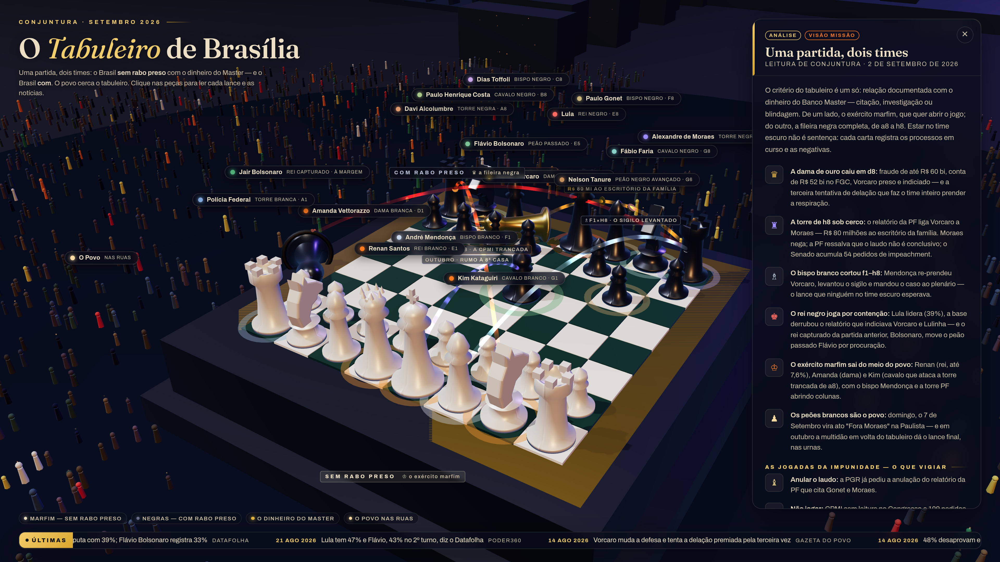

# O Tabuleiro de Brasília

**Painel 3D de conjuntura política — setembro de 2026.**
Uma partida de xadrez em alta definição sobre a Esplanada: de um lado o exército
marfim (**sem rabo preso** com o dinheiro do Banco Master), do outro a fileira
negra completa (**com rabo preso**) — e o povo, com as luzes acesas, cercando o
tabuleiro.

**▶ Ao vivo:** https://lfamorim.github.io/brazil-chess/



## O que tem no tabuleiro

- **Dois exércitos, regras de verdade.** Fileiras completas, peças clássicas:
  Renan Santos (rei branco), Amanda Vettorazzo (dama), Kim Kataguiri (cavalo),
  André Mendonça (bispo), a Polícia Federal (torre) e os peões brancos — o povo.
  Do lado escuro, de a8 a h8: Alcolumbre, Paulo Henrique Costa (BRB), Toffoli,
  Vorcaro (a dama de ouro, caída), Lula, Gonet, Fábio Faria e Moraes — mais o
  peão passado Flávio a caminho da 8ª casa, Tanure avançado e Bolsonaro,
  capturado, à margem do tabuleiro.
- **Os movimentos desenhados.** Arcos luminosos explicam os lances: os
  R$ 80 milhões ao escritório da família de Moraes, o bispo f1×h8 de Mendonça
  (o sigilo levantado), o 27 anos + domiciliar, o cavalo g1×a8 contra a CPMI
  trancada e a corrida de outubro rumo à coroação.
- **As notícias.** Cada peça abre uma carta com análise e manchetes reais e
  datadas (Poder360, Gazeta do Povo, Agência Brasil, Senado, TSE, STF, CNN,
  Datafolha…), além de um letreiro de últimas notícias.
- **Enquete e vigília.** Uma enquete simbólica ("qual o melhor próximo lance?",
  só lances legais — o voto fica no navegador) e a lista das **jogadas da
  impunidade** para vigiar.
- **O povo nas ruas.** Milhares de pessoas ao redor do pedestal, com luzes de
  celular cintilando, e a Brasília noturna ao fundo.

## Rodando localmente

É um único `index.html` (Three.js r128 via CDN, fontes do Google Fonts).

```bash
python3 -m http.server 8080
# abra http://localhost:8080
```

Arraste para orbitar, role para aproximar, clique nas peças e nos nomes.
O parâmetro `?shot=1` fixa a câmera na composição de divulgação.

## Aviso

Painel **independente de análise política, com visão declarada (Missão)**.
As peças, os times e os lances são **metáforas de opinião**; os fatos, as datas
e as **negativas dos citados** vêm do noticiário referenciado em cada carta.
Estar em um time do tabuleiro **não é acusação formal nem sentença** — os
processos citados estão em curso.
